```{r setup, include=FALSE}
knitr::opts_chunk$set(message = FALSE, 
                      warning = FALSE, 
                      fig.retina = 3,
                      comment = NA)
```

class: inverse, left, middle

background-image: url(resources/images/cover.gif)
background-size: cover

# Análise de dados de COVID 19: <br> utilizando CP4D e DB2

## Educathon 2022


Thiago Pires | Abr 2022 <br><br><br>
Repositório [github.com/th1460/ibm-educathon-2022](https://github.com/th1460/ibm-educathon-2022) <br>
Slides [th1460.github.io/ibm-educathon-2022](https://th1460.github.io/ibm-educathon-2022)

---
layout: true

background-image: url(resources/images/logo-ibm.png)
background-position: 97% 3%
background-size: 7%

---
# Thiago Pires

.pull-left[

]
.pull-right[
```{r echo=FALSE, fig.height=6}
require(magrittr, include.only = "%>%")
events <- 
  dplyr::bind_rows(
    dplyr::tibble(evento = "Estatística (2007)", 
                  lat = -22.9229416, 
                  lng = -43.2419579,
                  file = "https://www.uerj.br/wp-content/uploads/2018/02/logomarca-uerj.png"),
    dplyr::tibble(evento = "MSc. Epidemilogia (2011)",
                  lat = -22.8775207,
                  lng = -43.2483072,
                  file = "https://www.gedaf.com.br/wp-content/uploads/2018/05/fiocruz-logo.jpg"),
    dplyr::tibble(evento = "DSc. Engenharia Biomédica (2017)",
                  lat = -22.9015659,
                  lng = -43.2765342,
                  file = "https://ufrj.br/wp-content/uploads/2022/02/marca-ufrj-vertical-positiva.png"),
    dplyr::tibble(evento = "Cientista de Dados (2019)",
                  lat = -22.8996401,
                  lng = -47.2032362,
                  file = "https://www.ibm.com/brand/experience-guides/developer/8f4e3cc2b5d52354a6d43c8edba1e3c9/02_8-bar-reverse.svg")
  )

leaflet::leaflet(options = list(closePopupOnClick = FALSE)) %>%
  leaflet::setView(lng = -45.9, lat = -22.8, zoom = 6) %>%
  leaflet::addTiles() %>%
  leaflet::addPopups(data = events %>% dplyr::slice(4), ~lng, ~lat,
                     options = leaflet::popupOptions(closeButton = FALSE), 
                     popup = ~paste(" <br>", evento)) %>%
  leaflet::addCircleMarkers(data = events %>% dplyr::slice(1:3), ~lng, ~lat,
                            popup = ~paste(" <br>", evento),
                            clusterOptions = leaflet::markerClusterOptions()) %>%
  leaflet::addPolylines(data = events, ~lng, ~lat)
```
]

---
class: left middle
background-color: #00b33c

# Criando uma conta na IBM Cloud

---
# Criando uma conta na IBM Cloud

.pull-left[
- Acesse https://cloud.ibm.com
- Clicar em <mark>Create an account</mark>

```{r echo=FALSE, out.width="90%"}
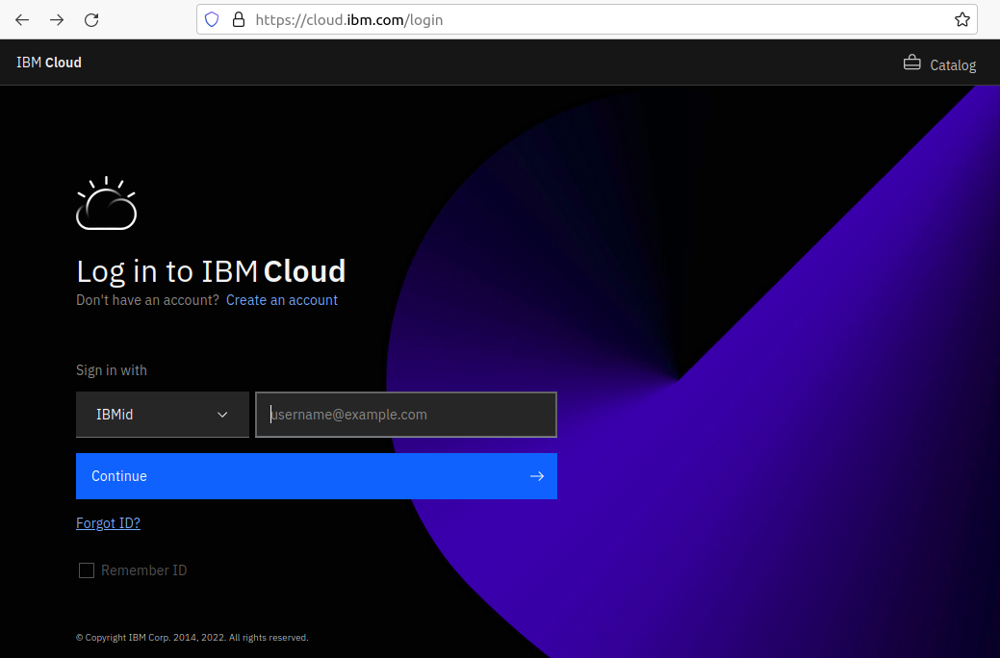
```
]

.pull-right[
- Preencha o formulário com o email e informações pessoais
- <mark>Não precisa incluir um cartão de crédito</mark> para utilizar os recursos da cloud necessários para este workshop!

```{r echo=FALSE, out.width="90%"}
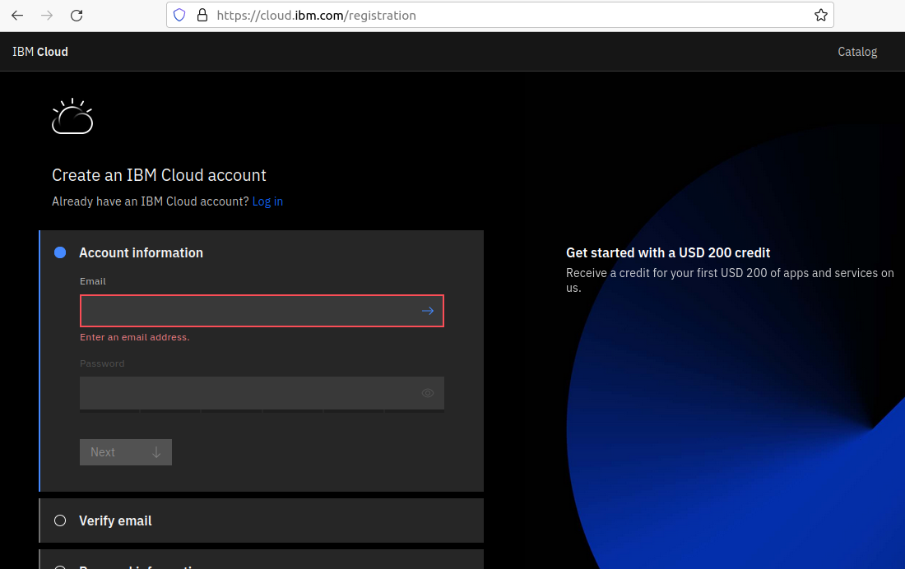
```

]

---
class: left middle
background-color: #ffcc31

# Cloud Pak for Data

---
# Cloud Pak for Data

>*O Cloud Pak for Data (CP4D) <mark>é uma plataforma de análise que ajuda a preparar dados para inteligência artificial (IA)</mark>. Ele permite que engenheiros de dados, administradores de dados, cientistas de dados e analistas de negócios colaborem usando uma plataforma multicloud integrada.*

## Acessando o recurso na Cloud

.pull-left[
```{r echo=FALSE, out.width="100%", fig.align="center"}
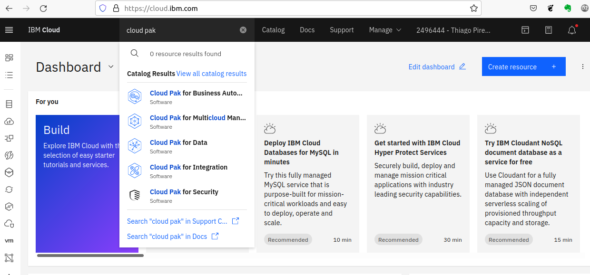
```
]
.pull-right[

<mark>Clicar em Launch</mark> para iniciar o recurso.

```{r echo=FALSE, out.width="60%", fig.align="center"}
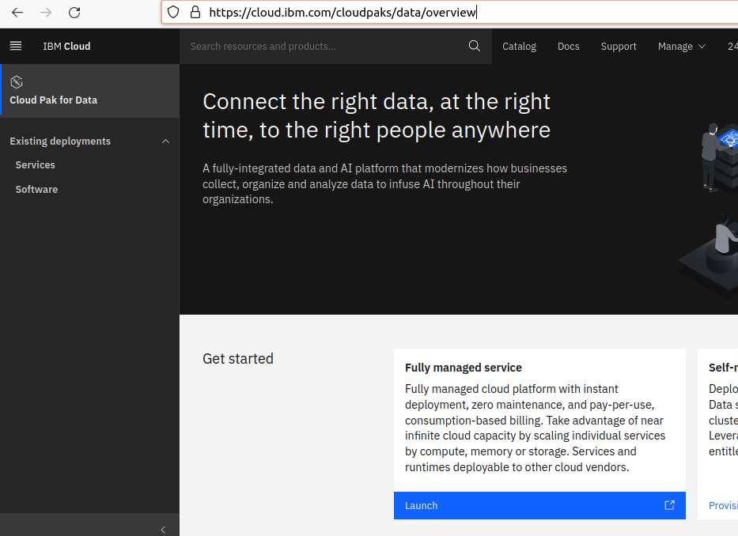
```
]

---
# Bem-vindo ao Cloud Pak for Data

```{r echo=FALSE, out.width="50%", fig.align="center"}
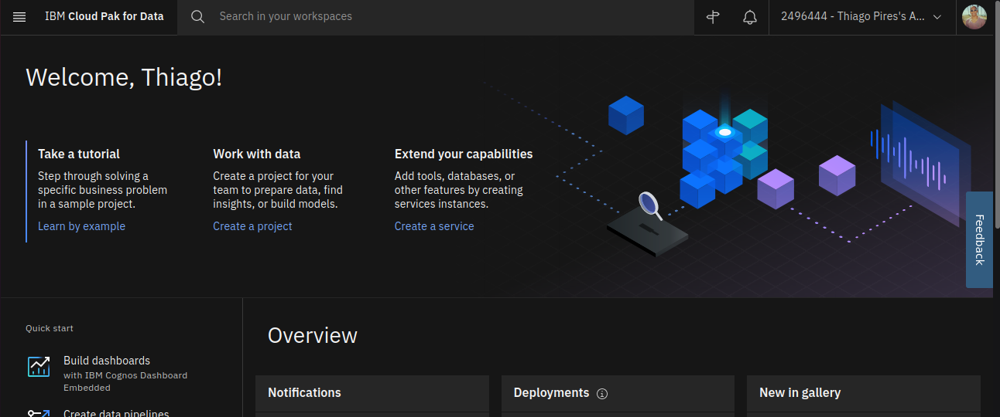
```

## Criar um projeto

.pull-left[
```{r echo=FALSE, out.width="90%", fig.align="center"}
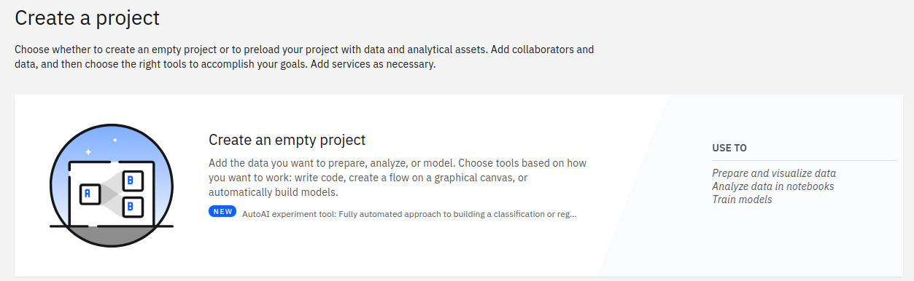
```
]

.pull-right[
Em seguida:
- Definir um none (mandatório)
- Colocar uma descrição (opcional)
- Associar um Cloud Object Storage (mandatório)
]

---
# Visão geral do projeto
```{r echo=FALSE, out.width="90%", fig.align="center"}
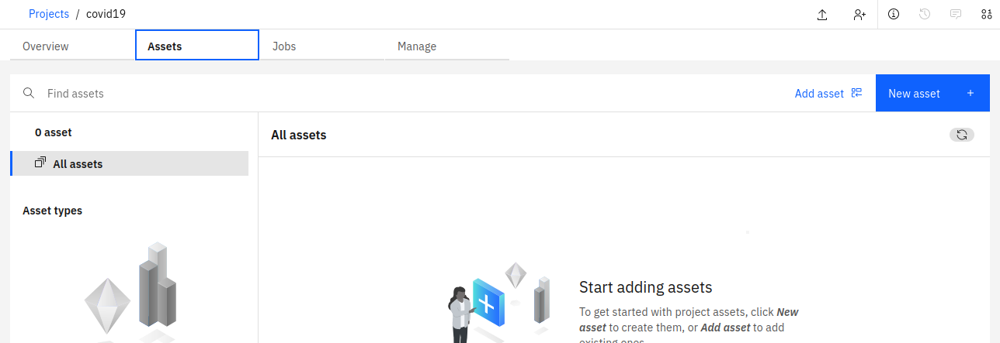
```

---
# Criar serviços

.pull-left[
- Clicar em <mark>Create a service</mark>.
```{r echo=FALSE, out.width="90%", fig.align="center"}
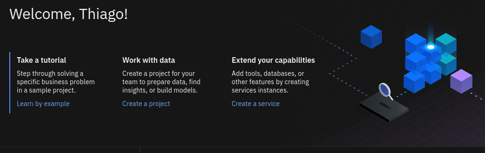
```

- Adicionar <mark>Watson Studio</mark>
```{r echo=FALSE, out.width="90%", fig.align="center"}

```

- Ir para https://dataplatform.cloud.ibm.com/projects/ e clicar no projeto criado anteriormente
]

.pull-right[
- Ir para <mark>Launch IDE>RStudio</mark>
```{r echo=FALSE, out.width="90%", fig.align="center"}
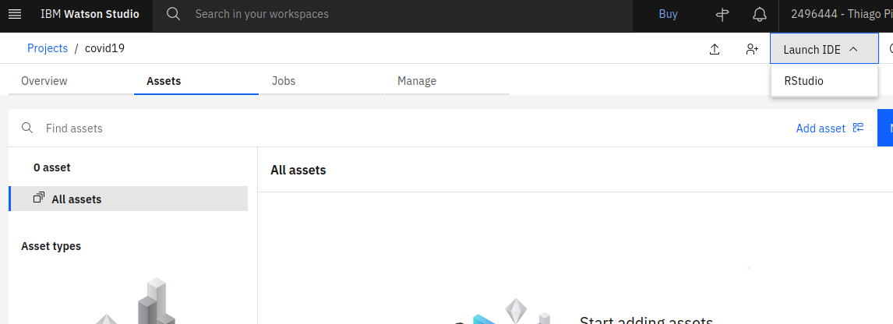
```

- <mark>Launch RStudio</mark> com a configuração sugerida
```{r echo=FALSE, out.width="90%", fig.align="center"}
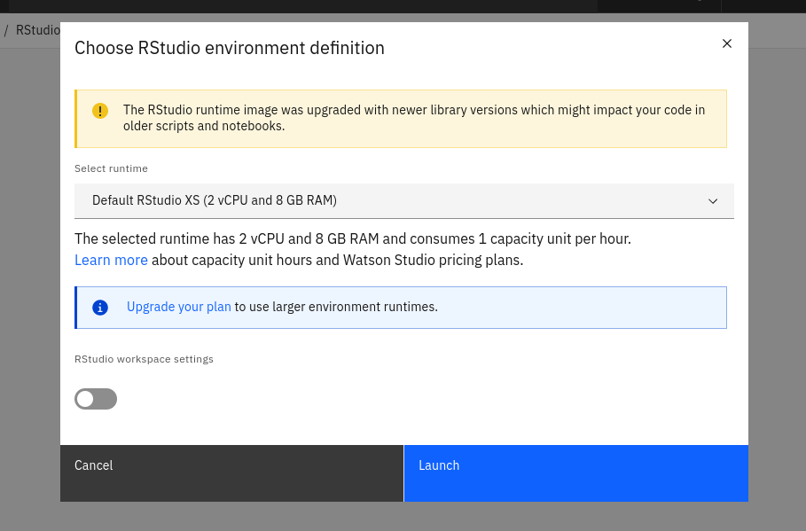
```
]

---
# RStudio
```{r echo=FALSE, out.width="100%", fig.align="center"}
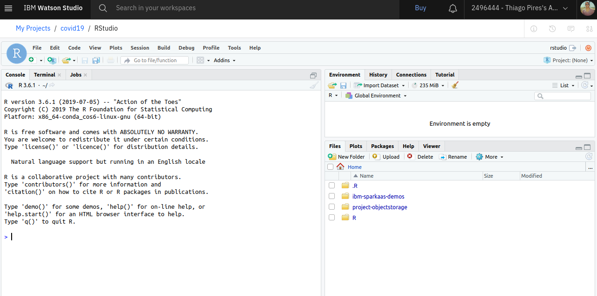
```

---
# Adicionando o DB2 no projeto

>*O DB2 é um <mark>banco de dados SQL</mark> em cloud totalmente gerenciado e com escalabilidade sob demanda de computação e armazenamento.*

.pull-left[
- Ir na <mark>pesquisa por recursos</mark>
```{r echo=FALSE, out.width="90%", fig.align="center"}
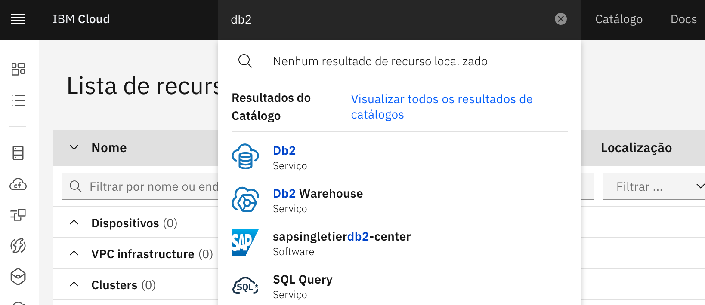
```

- O DB2 estará listado como <mark>ativo</mark>
```{r echo=FALSE, out.width="90%", fig.align="center"}
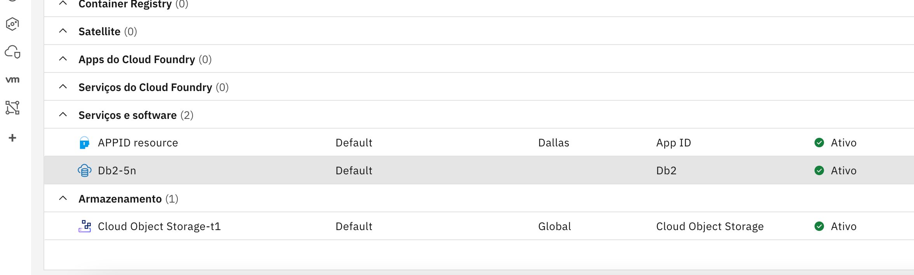
```
]

.pull-right[
- <mark>Criar credencial</mark> de acesso
```{r echo=FALSE, out.width="90%", fig.align="center"}
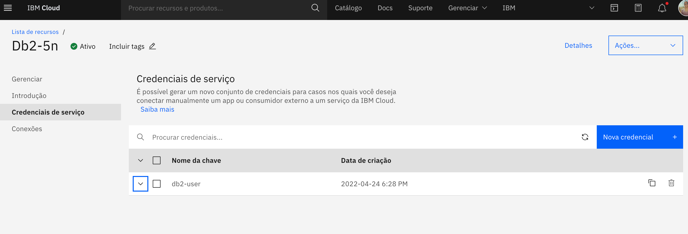
```

>*<mark>SQL significa Standard Query Language</mark>, literalmente a linguagem padrão para realizar queries. A linguagem SQL é utilizada de maneira relativamente parecida entre os principais bancos de dados relacionais do mercado*

>*<mark>Bancos de dados relacionais</mark> são baseados no modelo relacional, uma maneira intuitiva e direta de representar dados em tabelas.*
]

---
# Preparando o ambiente

Baixar repositório no RStudio
```{bash eval=FALSE}
git clone https://github.com/th1460/ibm-educathon-2022.git
```

Instalar bibliotecas que serão utilizadas no projeto
```{r eval=FALSE}
install.packages("renv")
renv::restore()
```

---
class: left middle
background-color: #d74c3c

# Análises

---
# Ler dados bruto

```{r}
require(magrittr, include.only = "%>%")
require(dbplyr)

url <- "https://raw.githubusercontent.com/CSSEGISandData/COVID-19/master/csse_covid_19_data/csse_covid_19_time_series/time_series_covid19_confirmed_global.csv"

covid19 <- 
  read.csv(url, stringsAsFactors = FALSE)

covid19 %>% 
  dplyr::select(1:9) %>%
  dplyr::glimpse()
```

---
# Preparar dados

.pull-left[
```{r preparar, eval=FALSE}
(covid19 <- 
   covid19 %>% 
   dplyr::filter(Country.Region %in% 
                   c("Brazil", "Peru", "Bolivia", 
                     "Chile", "Argentina", "Colombia",
                     "Venezuela", "Ecuador", "Uruguay",
                     "Paraguay")) %>% 
   dplyr::select(- Province.State) %>% 
   tidyr::pivot_longer(!Country.Region:Long, 
                       names_to = "date", 
                       values_to = "cumulate") %>% 
   dplyr::group_by(Country.Region) %>% 
   dplyr::mutate(date = gsub("X", "", date) %>% 
                   gsub("\\.", "-", .) %>% 
                   lubridate::mdy(),
                 value = cumulate - dplyr::lag(cumulate)) %>% 
   dplyr::ungroup() %>%
   dplyr::rename(country = Country.Region))

```
]

.pull-right[
```{r preparar, echo=FALSE}
```
]

---
# Salvar dados no DB2

```{r}
# Ler variáveis de ambiente
readRenviron("../.Renviron") 

# Criar conexão com o banco
drv <-
  RJDBC::JDBC("com.ibm.db2.jcc.DB2Driver", "../jars/db2jcc4.jar")

host <- Sys.getenv("DB2_HOST")
user <- Sys.getenv("DB2_USER")
password <- Sys.getenv("DB2_PASSWORD")

uri <- 
  sprintf("jdbc:db2://%s/bludb:user=%s;password=%s;sslConnection=true;", 
          host, user, password)

db2 <-
  DBI::dbConnect(drv, uri)
```

```{r eval=FALSE}
# Escrever tabela no banco de dados
DBI::dbWriteTable(db2, "COVID19", value = covid19, overwrite = TRUE)
```

---
# Ler dados do DB2

```{r}
dplyr::tbl(db2, "COVID19") %>%
  dplyr::filter(COUNTRY == "Brazil")
```

---
# Análises

```{r}
brazil <- dplyr::tbl(db2, "COVID19") %>%
  dplyr::filter(COUNTRY == "Brazil") %>%
  dplyr::as_tibble() %>%
  dplyr::mutate(DATE = DATE %>% lubridate::ymd())
```

## Distribuição do número de casos diários

.pull-left[
```{r plot1, eval=FALSE}
brazil %>%
  ggplot2::ggplot() +
  ggplot2::aes(DATE, VALUE) +
  ggplot2::geom_line() +
  ggplot2::theme_minimal() +
  ggplot2::labs(x = "Data", 
                y = "# de casos de COVID 19")
```
]

.pull-right[
```{r plot1, echo=FALSE, fig.height=4, fig.width=7, fig.align="center"}
```
]

---
# Análises
## Distribuição da média móvel de 7 dias de casos

```{r}
brazil <- 
  brazil %>%
  dplyr::mutate(MOVING_AVERAGE = zoo::rollmean(VALUE, 7, align = "right", fill = NA)) #<<
```

.pull-left[
```{r plot2, eval=FALSE}
brazil %>%
  ggplot2::ggplot() +
  ggplot2::aes(DATE, MOVING_AVERAGE) +
  ggplot2::geom_line() +
  ggplot2::theme_minimal() +
  ggplot2::labs(x = "Data", 
                y = "Média móvel de casos de COVID 19")
```

]
.pull-right[
```{r plot2, echo=FALSE, fig.height=4, fig.width=7, fig.align="center"}
```
]

---
# Análises
## Valor máximo da distribuição de média móvel de 7 dias de casos

```{r}
brazil %>%
  dplyr::filter(MOVING_AVERAGE == max(MOVING_AVERAGE, na.rm = TRUE)) %>%
  dplyr::select(COUNTRY, DATE, MOVING_AVERAGE) %>%
  reactable::reactable()
```

---
# Análises
## Distribuição da média móvel de 7 dias de casos (plotly)

.pull-left[
```{r plot3, eval=FALSE}
gg <- brazil %>%
  ggplot2::ggplot() +
  ggplot2::aes(DATE, MOVING_AVERAGE) +
  ggplot2::geom_line() +
  ggplot2::theme_minimal() +
  ggplot2::labs(x = "Data", 
                y = "Média móvel de casos de COVID 19")
gg %>% 
  plotly::ggplotly() #<<
```
]
.pull-right[
```{r plot3, echo=FALSE, fig.height=5, fig.width=7, fig.align="center"}
```
]

---
# Análises
## Variação entre a média móvel mais atual e a média móvel anterior

```{r delta, eval=FALSE}
delta <- dplyr::tbl(db2, "COVID19") %>%
  dplyr::filter(DATE %in% c("2022-04-22", "2022-04-23")) %>%
  dplyr::as_tibble() %>%
  dplyr::mutate(DATE = DATE %>% lubridate::ymd(),
                MOVING_AVERAGE = zoo::rollmean(VALUE, 7, align = "right", fill = NA)) %>%
  dplyr::group_by(COUNTRY) %>%
  dplyr::mutate(`DELTA%` = (MOVING_AVERAGE - dplyr::lag(MOVING_AVERAGE))/dplyr::lag(MOVING_AVERAGE) * 100, #<<
                `DELTA%` = ifelse(is.na(`DELTA%`), 0, round(`DELTA%`, 1))) %>%
  dplyr::filter(DATE == "2022-04-23")

gg <- delta %>%
  dplyr::select(COUNTRY, `DELTA%`) %>%
  ggplot2::ggplot() +
  ggplot2::aes(COUNTRY, `DELTA%`) +
  ggplot2::geom_col(fill = ifelse(delta$`DELTA%` > 0, "#cb6e5d", "#005c5b")) +
  ggplot2::theme_minimal() +
  ggplot2::labs(x = "Países", y = "Delta %")
plotly::ggplotly(gg)
```

---
# Análises
## Variação entre a média móvel mais atual e a média móvel anterior

```{r delta, echo=FALSE, fig.align="center", fig.height=6, fig.width=10}
```

---
# Análises
## Mapa com as variações percentuais

.pull-left[
```{r mapa, eval=FALSE}
conpal <- 
  leaflet::colorNumeric(palette = "RdBu", 
                        domain = delta$`DELTA%`, 
                        na.color = "black", 
                        reverse = TRUE)

delta %>%
  dplyr::select(COUNTRY, LAT, LONG, `DELTA%`) %>%
  leaflet::leaflet() %>%
  leaflet::addProviderTiles("CartoDB.DarkMatter") %>%
  leaflet::addCircleMarkers(~LONG, ~LAT, 
                            label = paste(delta$COUNTRY, " ", 
                                          round(delta$`DELTA%`, 1)),
                            color = ~conpal(delta$`DELTA%`)) %>%
  leaflet::addLegend(position = "bottomleft", 
                     title = "Delta %",
                     pal = conpal, 
                     values = delta$`DELTA%`,
                     opacity = 0.8)
```
]
.pull-right[
```{r mapa, echo=FALSE, fig.height=6}
```
]

---
# Funções SQL

```{r}
dplyr::tbl(db2, "COVID19") %>%
  dplyr::mutate(REF_DATE = dplyr::sql("VARCHAR_FORMAT(LAST_DAY(TO_DATE(DATE, 'YYYYMMDD')), 'YYYY-MM-DD')")) %>% #<<
  dplyr::group_by(COUNTRY, REF_DATE) %>%
  dplyr::summarise(SUM = sum(VALUE, na.rm = TRUE), .groups = "drop") %>%
  dplyr::filter(COUNTRY == "Brazil")
```

---
class: inverse center middle
background-color: #000

.pull-left[
# Obrigado!
]

.pull-right[
[th1460.github.io](https://th1460.github.io/)<br>
[github.com/th1460](https://github.com/)<br>
[medium.com/@thopr](https://medium.com/@thopr)<br>
[linkedin.com/in/thop](https://www.linkedin.com/in/thop)<br><br>
slides [th1460.github.io/ibm-educathon-2022](https://th1460.github.io/ibm-educathon-2022)
]