---
output:
  xaringan::moon_reader:
    seal: false
    lib_dir: libs
    css: ["default", "rladies-fonts", "resources/css/progress.css", "resources/css/adds.css"]
    nature:
      ratio: "16:9"
      highlightStyle: github
      highlightLines: true
      countIncrementalSlides: false
      slideNumberFormat: |
        <div class="progress-bar-container">
          <div class="progress-bar" style="width: calc(%current% / %total% * 100%);">
          </div>
        </div>
---

```{r setup, include=FALSE}

knitr::opts_chunk$set(message = FALSE, 
                      warning = FALSE, 
                      fig.retina = 3)

```

class: inverse, left, middle

background-image: url(resources/images/cover.gif)
background-size: cover

# Análise de dados de COVID 19: <br> utilizando CP4D e DB2

## Educathon


Thiago Pires | Abr 2022

---
layout: true

background-image: url(resources/images/logo-ibm.png)
background-position: 97% 3%
background-size: 7%

---
class: left middle
background-color: #00b33c

# Criando uma conta na IBM Cloud

---
# Criando uma conta na IBM Cloud

.pull-left[
- Acesse https://cloud.ibm.com
- Clicar em <mark>Create an account</mark>

```{r echo=FALSE, out.width="90%"}
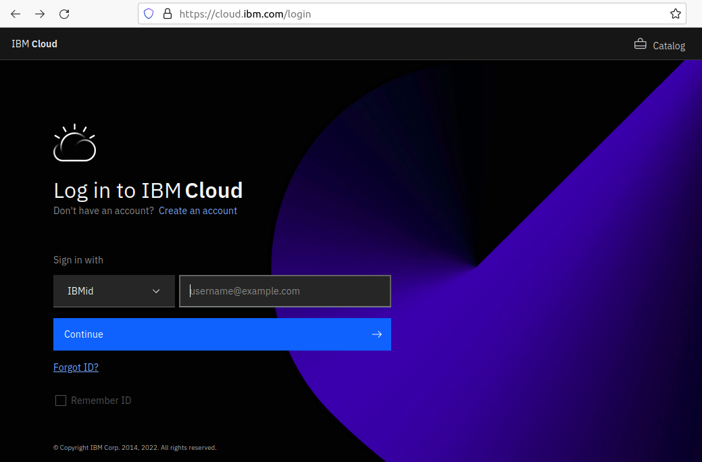
```
]

.pull-right[
- Preencha o formulário com o email e informações pessoais
- <mark>Não precisa incluir um cartão de crédito</mark> para utilizar os recursos da cloud necessários para este workshop!

```{r echo=FALSE, out.width="90%"}
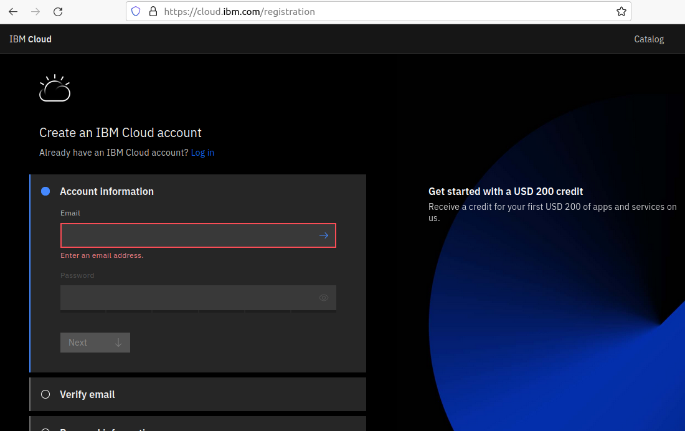
```

]

---
class: left middle
background-color: #00b33c

# Cloud Pak for Data

---
# Cloud Pak for Data

>*O Cloud Pak for Data (CP4D) <mark>é uma plataforma de análise que ajuda a preparar dados para inteligência artificial (IA)</mark>. Ele permite que engenheiros de dados, administradores de dados, cientistas de dados e analistas de negócios colaborem usando uma plataforma multicloud integrada.*

## Acessando o recurso na Cloud

.pull-left[
```{r echo=FALSE, out.width="100%", fig.align="center"}
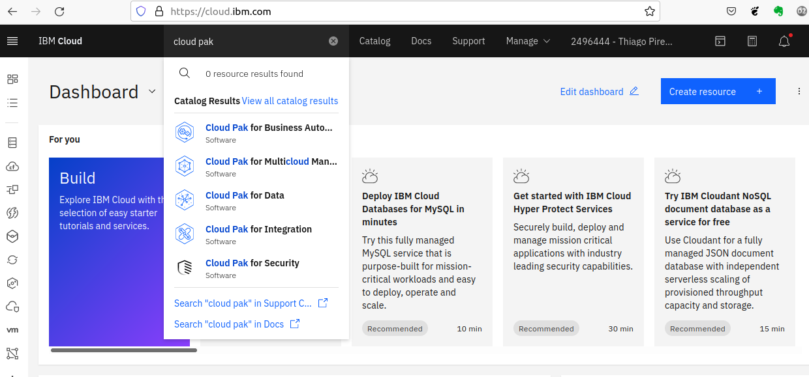
```
]
.pull-right[

<mark>Clicar em Launch</mark> para iniciar o recurso.

```{r echo=FALSE, out.width="60%", fig.align="center"}
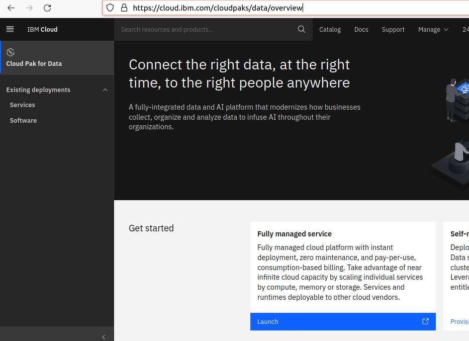
```
]

---
# Bem-vindo ao Cloud Pak for Data

```{r echo=FALSE, out.width="50%", fig.align="center"}
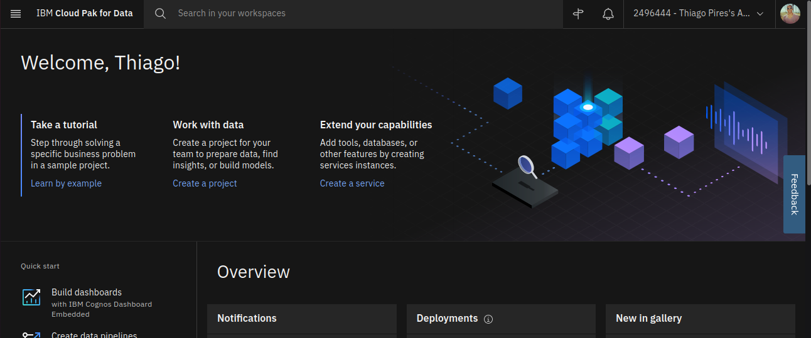
```

## Criar um projeto

.pull-left[
```{r echo=FALSE, out.width="90%", fig.align="center"}
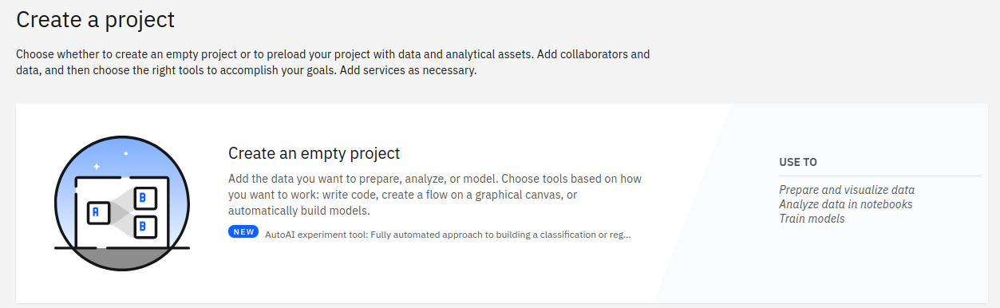
```
]

.pull-right[
Em seguida:
- Definir um none (mandatório)
- Colocar uma descrição (opcional)
- Associar um Cloud Object Storage (mandatório)
]

---
# Visão geral do projeto
```{r echo=FALSE, out.width="90%", fig.align="center"}
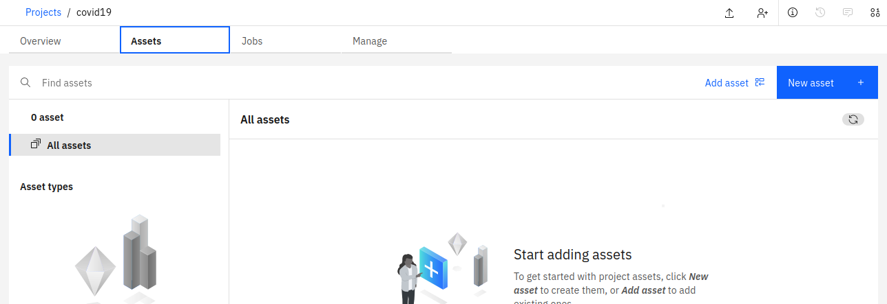
```

---
# Criar serviços

.pull-left[
- Clicar em <mark>Create a service</mark>.
```{r echo=FALSE, out.width="90%", fig.align="center"}
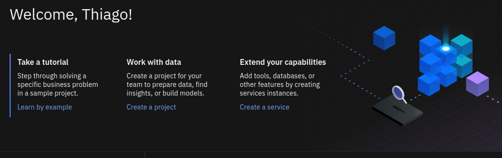
```

- Adicionar <mark>Watson Studio</mark>
```{r echo=FALSE, out.width="90%", fig.align="center"}
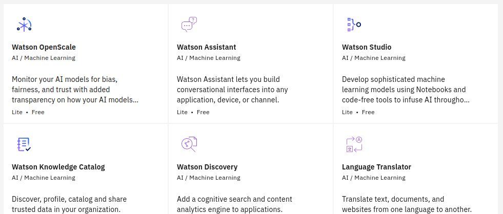
```

- Ir para https://dataplatform.cloud.ibm.com/projects/ e clicar no projeto criado anteriormente
]

.pull-right[
- Ir para <mark>Launch IDE>RStudio</mark>
```{r echo=FALSE, out.width="90%", fig.align="center"}
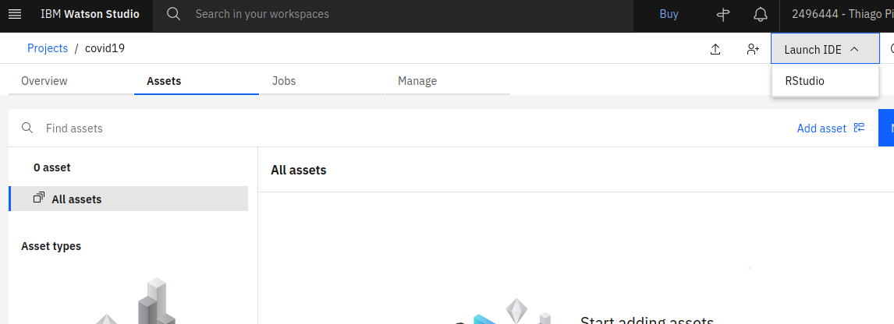
```

- <mark>Launch RStudio</mark> com a configuração sugerida
```{r echo=FALSE, out.width="90%", fig.align="center"}
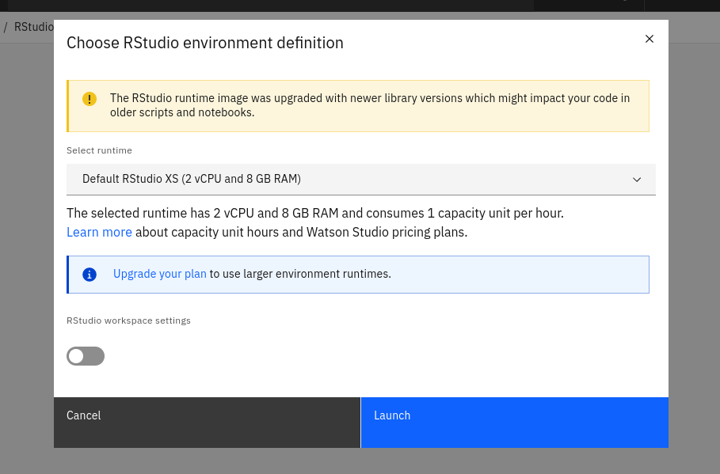
```
]

---
# RStudio
```{r echo=FALSE, out.width="100%", fig.align="center"}
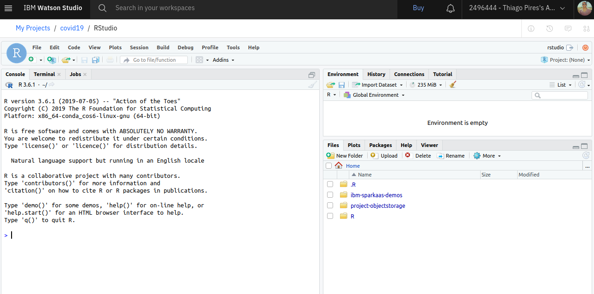
```

---
# Adicionando o DB2 no projeto

>*Um <mark>banco de dados SQL</mark> em cloud totalmente gerenciado e com escalabilidade sob demanda de computação e armazenamento.*

.pull-left[
- Ir na <mark>lista de recursos</mark>
```{r echo=FALSE, out.width="90%", fig.align="center"}
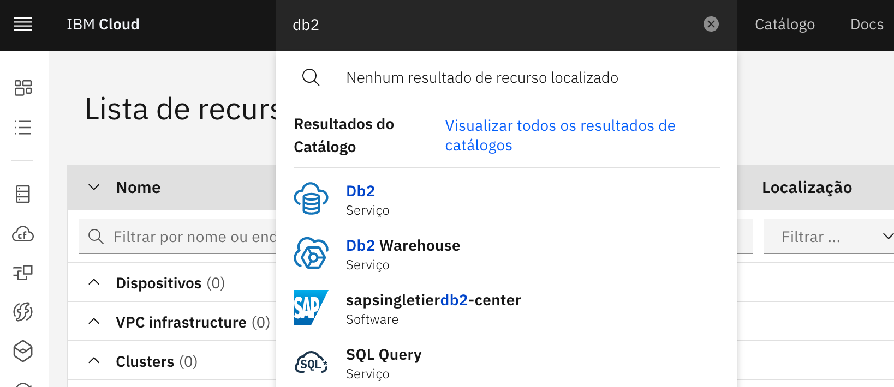
```
]

.pull-right[

]
